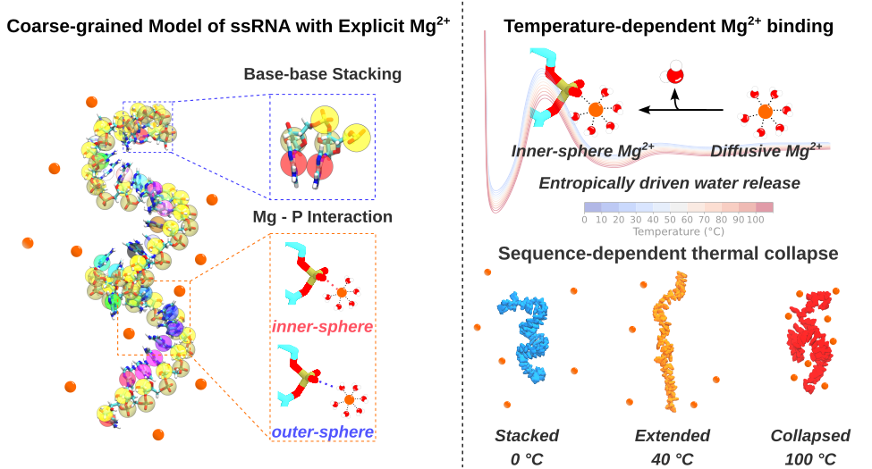

# Temperature-Dependent Ion Migration Underlies Sequence-Specific Collapse of Unstructured RNA



The code is organized into two main parts:

- `model/`: OpenMM implementation of the coarse-grained RNA model with explicit Mg$^{2+}$ ions and implicit monovalent salt/water effects.
- `analysis/`: scripts and notebooks used to analyze trajectories and generate the main manuscript figures.

The repository is intended to help readers reproduce the simulation setup, understand how the model was implemented, and follow the analysis workflow used in the paper.

---

## Repository structure

```text
biophysical-temperature-dependent-ssRNA/
├── README.md
├── model/
│   ├── ForceField.xml
│   ├── build.py
│   ├── force.py
│   ├── main.py
│   ├── example-run.py
│   ├── pmf_MgP.t0
│   ├── pmf_MgP.t20
│   ├── pmf_MgP.t40
│   ├── pmf_MgP.t60
│   ├── pmf_MgP.t80
│   └── pmf_MgP.t100
└── analysis/
    ├── Fig2/
    ├── Fig3/
    ├── Fig4/
    ├── Fig5/
    ├── 2D-ion-projection.py
    ├── OCF.py
    ├── SASA.py
    ├── align-traj.py
    ├── inner-outer.py
    └── local-concentration.py
```

---

## Model overview

The model is a three-interaction-site coarse-grained representation of single-stranded RNA. Each nucleotide is represented by phosphate, sugar, and base beads. The simulation includes explicit Mg$^{2+}$ ions, while monovalent salt and solvent effects are treated implicitly.

The total potential energy includes bonded terms, excluded-volume interactions, base-stacking interactions, Debye--Hückel electrostatics, and a temperature-dependent Mg$^{2+}$--phosphate interaction derived from potential of mean force tables.

The Mg$^{2+}$--phosphate PMF files are provided at several temperatures:

```text
pmf_MgP.t0
pmf_MgP.t20
pmf_MgP.t40
pmf_MgP.t60
pmf_MgP.t80
pmf_MgP.t100
```

These files are used by the OpenMM model to define temperature-dependent Mg$^{2+}$--RNA interactions.

---

## Installation

A typical Python environment should include:

```bash
conda create -n ssrna-cg python=3.10 -y
conda activate ssrna-cg

conda install -c conda-forge openmm numpy scipy pandas matplotlib tqdm biopython mdanalysis -y
pip install freesasa
```

For GPU simulations, install an OpenMM build compatible with your CUDA version. The current example in `main.py` uses the CPU platform by default. To run on GPU, edit the platform section in `model/main.py` and use the CUDA platform.

---

## Running a simulation

Move into the model directory:

```bash
cd model
```

An example command for a 30-mer polyadenosine chain is:

```bash
python main.py \
  -f AAAAAAAAAAAAAAAAAAAAAAAAAAAAAA \
  -c 100 \
  -T 20 \
  -ts 2 \
  -t md.dcd \
  -e md-energy.out \
  -o md.out \
  -x 10000 \
  -s 1000000000 \
  -K 20 \
  -M 5 \
  -v 500 \
  -n rA30-cg.pdb \
  -r check-point.chk
```

### Main options

| Option | Meaning |
|---|---|
| `-f`, `--sequence` | RNA sequence used to build the initial coarse-grained structure. For example, `AAAAAAAAAAAAAAAAAAAAAAAAAAAAAA` for rA30. |
| `-p`, `--pdb` | Input all-atom PDB file to build a coarse-grained model. |
| `-pc`, `--pdb_coordinates` | Input coarse-grained PDB coordinates. |
| `-T`, `--temperature` | Simulation temperature in °C. |
| `-K`, `--monovalent_concentration` | Monovalent salt concentration in mM. |
| `-M`, `--divalent_concentration` | Mg$^{2+}$ concentration in mM. |
| `-v`, `--box_size` | Cubic box length in Å. |
| `-s`, `--step` | Number of MD steps. |
| `-ts`, `--time_step` | Time step in fs. |
| `-x`, `--frequency` | Output frequency in steps. |
| `-t`, `--traj` | DCD trajectory output. |
| `-e`, `--energy` | Energy decomposition output. |
| `-o`, `--output` | OpenMM state-data output. |
| `-n`, `--pdb_name` | Initial coarse-grained PDB output. |
| `-r`, `--res_file` | Checkpoint output file. |
| `-R`, `--resume` | Resume simulation from a checkpoint. |
| `-fr`, `--from_res_file` | Checkpoint file used for restart. |

### Typical output files

A successful run produces files such as:

```text
rA30-cg.pdb          # initial coarse-grained structure
md.dcd              # trajectory
md.out              # OpenMM state-data output
md-energy.out       # energy decomposition by force group
check-point.chk     # checkpoint file
system.out          # simulation input summary
```

---

## Restarting a simulation

To continue from a checkpoint, use the restart options:

```bash
python main.py \
  -f AAAAAAAAAAAAAAAAAAAAAAAAAAAAAA \
  -T 20 \
  -K 20 \
  -M 5 \
  -v 500 \
  -s 100000000 \
  -x 10000 \
  -R \
  -fr check-point.chk \
  -t md-restart.dcd \
  -e md-restart-energy.out \
  -o md-restart.out \
  -r check-point-restart.chk
```

When restarting production simulations, make sure the sequence, temperature, salt conditions, box size, and force-field files match the original run.

---

## Analysis scripts

The `analysis/` directory contains scripts for trajectory post-processing and figure generation.

### 1. Orientation correlation function

`OCF.py` calculates the orientation correlation function from a selected set of atoms, typically phosphate beads.

```bash
python analysis/OCF.py \
  -p rA30-cg.pdb \
  -t md.dcd \
  --start 1000 \
  -o OCF.dat
```

Output:

```text
OCF.dat
```

The output contains the separation index and the corresponding orientation correlation value.

---

### 2. Inner- and outer-shell Mg$^{2+}$ counts

`inner-outer.py` counts Mg$^{2+}$ ions in inner- and outer-shell coordination around RNA phosphate beads.

Default cutoffs:

- Inner-shell Mg$^{2+}$: Mg--P distance `< 3.2 Å`
- Outer-shell Mg$^{2+}$: Mg--P distance between `3.2 Å` and `6.1 Å`

Example:

```bash
python analysis/inner-outer.py \
  -p rA30-cg.pdb \
  -t md.dcd \
  -r A \
  --start 3000 \
  -o hist_data.dat
```

Output:

```text
hist_data.dat
```

The output contains frame-by-frame counts of inner- and outer-shell Mg$^{2+}$ ions.

---

### 3. Radial local Mg$^{2+}$ concentration

`local-concentration.py` calculates radial ion concentration profiles around the center of a selected RNA group.

```bash
python analysis/local-concentration.py \
  -p rA30-cg.pdb \
  -t md.dcd \
  -c "resname ADE" \
  -i "resname Mg" \
  --box-size 500 \
  --start 3000 \
  -o local_concentration.dat
```

Output:

```text
local_concentration.dat
```

The output contains radial distance and local Mg$^{2+}$ concentration in mM.

---

### 4. Solvent-accessible surface area

`SASA.py` calculates the solvent-accessible surface area of the coarse-grained RNA beads using FreeSASA. The output is partitioned into base, sugar, phosphate, and total SASA.

```bash
python analysis/SASA.py \
  -p rA30-cg.pdb \
  -t md.dcd \
  -s "name A U C G S P P3" \
  --step 10 \
  -o sasa_partitioned_cg.dat
```

Output:

```text
sasa_partitioned_cg.dat
```

---

### 5. Trajectory alignment and ion projection

Additional scripts are provided for structural alignment and ion-atmosphere visualization:

```text
align-traj.py
2D-ion-projection.py
```

These scripts were used to process trajectories and visualize the spatial distribution of ions around the RNA conformational ensemble.

---

## Figure-specific analysis

The folders `Fig2/`, `Fig3/`, `Fig4/`, and `Fig5/` contain scripts and notebooks used to generate the corresponding manuscript figures. These directories are organized around the major analyses in the paper, including RNA compaction, Mg$^{2+}$ redistribution, structural correlations, and ion coordination behavior.

Because many figure scripts depend on local trajectory paths and intermediate data files, users may need to edit file paths before running them on a new machine.

---

## Notes on trajectory data

The scripts in this repository are intended to reproduce the model setup and analysis workflow. Large trajectory files are not included in the repository because of file-size limitations. If needed, trajectory data can be made available upon reasonable request.

---

## Citation

If you use this code, please cite the associated manuscript:

```text
(1) Zhang, H.; Maity, H.; Nguyen, H. Temperature-Dependent Ion Migration Underlies Sequence-Specific RNA Collapse. bioRxiv October 21, 2025, p 2025.10.20.683600. https://doi.org/10.1101/2025.10.20.683600.
```

---

## Contact

For questions about the model or analysis scripts, please contact:

```text
Peter Zhang
University at Buffalo
GitHub: peter-zhang-chem
```

---

## License

No license file is currently included. Please contact the authors before reusing or redistributing the code beyond academic inspection or reproduction of the reported analyses.